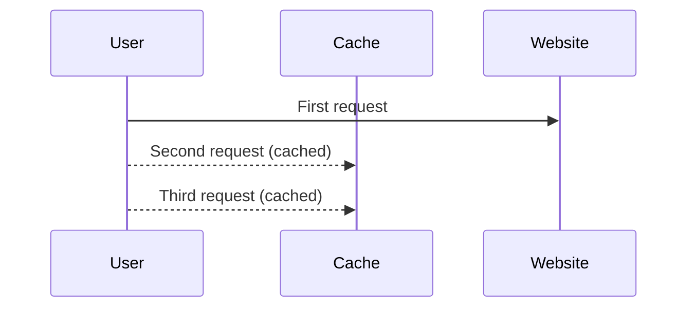
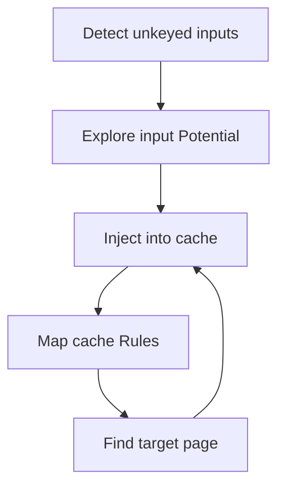
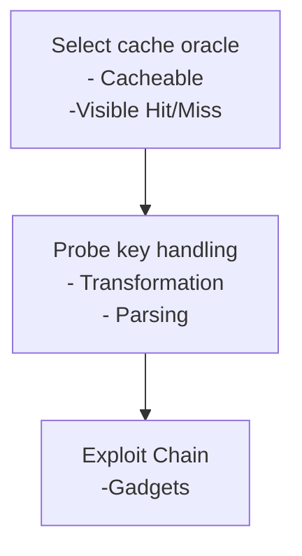

## Introduction

### Research on cache poisoning

The research on web poisoning vulnerabilities has been explained in the following writeups.

#### Pratical Web Cache Poisoning

The research by [James Kettle](https://twitter.com/albinowax) was published in 2018 to practically demonstrate how to compromise websites using esoteric features to deliver exploits.
The papers introduces the fundamentals of caching and how can be abused.

##### Caching 101

The purpose of caching in websites is to speed up page loads by reducing the latency, and also to reduce the load on the application server. The web caches sits between the user and the application's server, where they save and serve copies of certain responses. Example is a shown below.



When the user sends the first request to the server, the first request is sent to the server directly. If the server implements some caching mechanisms, the subsequent request are served from the cache.

The methodology deployed by the paper to identify the cache poisoning vulnerabilities is illustrated below.



The first step as shown is to identify the unkeyed inputs. After finding the unkeyed inputs, next step is to access the damage that can be done and get it stored in the cache. When auditing websites, it is advisable to use a cache buster to avoid accidentaly poisoning other users.

#### Novel Pathways to Poisoning

This papers tries to explain the inner workings of caches to find subtle inconsistencies, and combine these with gadgets to build exploit chains. The papers focuses mainly on two request components that are almost likely to included in the cache key( Host Header and Request Line).
The key methodology used for identifying this class of vulnerabilities are:



When selecting and oracle, the endpoint must be cacheable, and there must be some wat to tell you if you got cache hit or miss. Next step is identify if our request is transformed in any way when it's saved in the cache key. Common exploitable transformations include removing specific query parameters, remotving the entire query string, removing the port from Host header, and URL-decoding.

The final step is to transform the cache-key transformation into an exploit by finding quality gadgets to chain our transformation. Some of the ways gadgets can be combined to increase the severity are:

-   Increasing the severity of Reflected XSS into stored XSS
-   Enabling exploitation of dynamic content in resource files, Like JS and CSS
-   Enabling exploitation of "unexploitable" vulnerabilities thar rely on malformed requests that browsers won't send.

## Cache Poisoning Labs

These are the challenges or labs provided by portswigger academy to pratice and learn web cache poisoning vulnerability class.

### Web cache poisoning with an unkeyed header

> [!info]
> This lab is vulnerable to web cache poisoning because it handles input from an unkeyed header in an unsafe way. An unsuspecting user regularly visits the site's home page. To solve this lab, poison the cache with a response that executes alert(document.cookie) in the visitor's browser.

The handles unkeyed input in unsafe way. The first goal is to identify the unkeyed header and use it to deliver payload to the home page. By replaying the request to the website, we can see the server is caching the request as shown by the `hit` header.



Next step is to identify the unkeyed headers, to automate this we can use `param miner` burpsuite extension. The results are:

```Updating active thread pool size to 8
Loop 0
Loop 1
Queued 1 attacks from 1 requests in 0 seconds
Initiating header bruteforce on 0a54007604b10f80815cb227000d00ae.web-security-academy.net
Identified parameter on 0a54007604b10f80815cb227000d00ae.web-security-academy.net: x-forwarded-host~%s.%h
```

From the results, the tools has identified `X-Forwarded-Host` as unkeyed Host. By using the header with localhost,we can see the where the unkeyed header is transformed as shown in the image below.



Since we control the source of the Javascript file, we can exploit this by pointing the location of resource to our own file. The location of the file is:

```javascript
<script
    type="text/javascript"
    src="//localhost/resources/js/tracking.js"
></script>
```

We can now set our payload `alert(document.cookie)` in the Javascript file as shown below. This will be delivered to the victims when one access the homepage of the poisoned website.



By controlling the server location and sending the request several times, we are able to poison the cache and deliver our payload.

### Web cache poisoning with an unkeyed cookie

> [!NOTE]
> This lab is vulnerable to web cache poisoning because cookies aren't included in the cache key. An unsuspecting user regularly visits the site's home page. To solve this lab, poison the cache with a response that executes alert(1) in the visitor's browser.

Looking at the response, we are able to get unkeyed cookie



```html
<script>
    data = {
        host: "0a2d00d1034668fb80b553bb000c00fe.web-security-academy.net",
        path: "/",
        frontend: "prod-cache-01",
    };
</script>
```

By setting the cookie header `prod"-alert(1)-"prod` we are able to alter the response data

```html
<script>
    data = {
        host: "0ad400c3041e5d9180c0ad17005000b8.web-security-academy.net",
        path: "/",
        frontend: "prod" - alert(1) - "prod",
    };
</script>
```

Since, we control the data in the script. By escaping the literals, we are able to fire our alert payload.

### Web cache poisoning with multiple headers

> [!NOTE]
> This lab contains a web cache poisoning vulnerability that is only exploitable when you use multiple headers to craft a malicious request. A user visits the home page roughly once a minute. To solve this lab, poison the cache with a response that executes alert(document.cookie) in the visitor's browser.

The challenge is similiar to the first challenge only for it to be exploitable, there is a need to use multiple unkeyed headers to deliver a malicious request to the victim. First is to identify if the website implements some caching mechanism. Some of the hints are the response headers like `Cache-Control` and Hit or Miss by `X-Cache`.

To identify the unkeyed headers we use `paramminer` to guess the headers.

The identified headers by tool are `X-Forwarded-Scheme` wich specifies the client uses to make the request and `X-Forwarded-Host` which specifies the original host specified.



From the results above, the location of the redirected is poisoned. To exploit this, we can poison the Javascript resource ` /resources/js/tracking.js`, which will contain our payload.



By visiting the homepage, the payload is executed.

### Targeted web cache poisoning using an unknown header

> [!info]
> This lab is vulnerable to web cache poisoning. A victim user will view any comments that you post. To solve this lab, you need to poison the cache with a response that executes alert(document.cookie) in the visitor's browser. However, you also need to make sure that the response is served to the specific subset of users to which the intended victim belongs.

### Web cache poisoning via an unkeyed query string

> [!info]
> This lab is vulnerable to web cache poisoning because the query string is unkeyed. A user regularly visits this site's home page using Chrome
> To solve the lab, poison the home page with a response that executes alert(1) in the victim's browser.

```http
Pragma: x-get-cache-key
```

The payload used is



### Web cache poisoning via an unkeyed query parameter

> [!info]
> To solve the lab, poison the home page with a response that executes alert(1) in the victim's browser.
> To solve the lab, poison the cache with a response that executes alert(1) in the victim's browser.

Learn more about UTM parameters



### Parameter cloaking

> [info]
> This lab is vulnerable to web cache poisoning because it excludes a certain parameter from the cache key. There is also inconsistent parameter parsing between the cache and the back-end. A user regularly visits this site's home page using Chrome.
> To solve the lab, use the parameter cloaking technique to poison the cache with a response that executes alert(1) in the victim's browser.

### Web cache poisoning via a fat GET request

> [info]
> This lab is vulnerable to web cache poisoning. It accepts GET requests that have a body, but does not include the body in the cache key. A user regularly visits this site's home page using Chrome.



### URL normalization

> [info]
> This lab contains an XSS vulnerability that is not directly exploitable due to browser URL-encoding.
> To solve the lab, take advantage of the cache's normalization process to exploit this vulnerability. Find the XSS vulnerability and inject a payload that will execute alert(1) in the victim's browser. Then, deliver the malicious URL to the victim.

Look at random path is reflected on the home page
escape it and deliver it.


reload the request in the browser
after alert, deliver the link to the victim immediately

### Web cache poisoning to exploit a DOM vulnerability via a cache with strict cacheability criteria

> [info]
> This lab contains a DOM-based vulnerability that can be exploited as part of a web cache poisoning attack. A user visits the home page roughly once a minute. Note that the cache used by this lab has stricter criteria for deciding which responses are cacheable, so you will need to study the cache behavior closely.

### Combining web cache poisoning vulnerabilities

> [info]
> This lab is susceptible to web cache poisoning, but only if you construct a complex exploit chain.
> A user visits the home page roughly once a minute and their language is set to English. To solve this lab, poison the cache with a response that executes alert(document.cookie) in the visitor's browser.

### Cache key injection

> [info]
> This lab contains multiple independent vulnerabilities, including cache key injection. A user regularly visits this site's home page using Chrome.
> To solve the lab, combine the vulnerabilities to execute alert(1) in the victim's browser. Note that you will need to make use of the Pragma: x-get-cache-key header in order to solve this lab.

### Internal cache poisoning

> [info]
> This lab is vulnerable to web cache poisoning. It uses multiple layers of caching. A user regularly visits this site's home page using Chrome.
> To solve the lab, poison the internal cache so that the home page executes alert(document.cookie) in the victim's browser.
