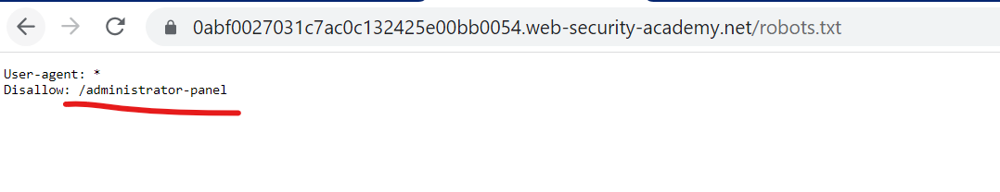
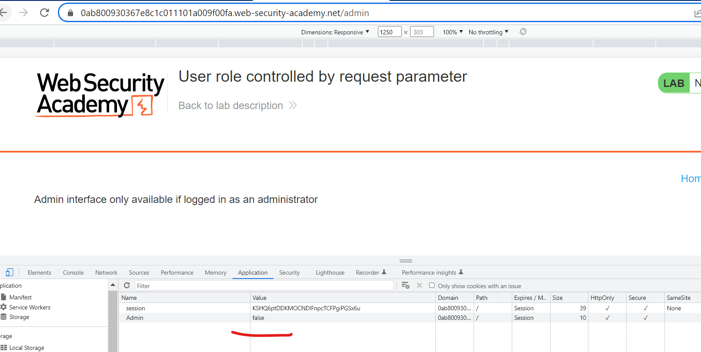

Access control vulnerabilities are web vulnerabilities that allows an user to access or modify they are not allowed to access or modify.This allows an user to perform actions they are not allowed to access.

Access control vulnerability may lead to an user doing a vertical or horizontal privilege escalation. Vertical escalation is where an user gets more access than the current role assigned while horizontal escalation is where an user can access another user's data or modify it.

To understand broken access control vulnerabilities impact by solving the **portswigger** academy labs.

## Lab1 - Unprotected admin functionality

> This lab has an unprotected admin panel.
> Solve the lab by deleting the user carlos.

In order to solve the lab we need to access the admin panel and delete an user from the system. To get the URL path to the admin panel, whe check the `Robots.txt` file.



By visiting the above path we are able to delete the user carlos


## Lab2 - Unprotected admin functionality with unpredictable URL

> This lab has an unprotected admin panel. It's located at an unpredictable location, but the location is disclosed somewhere in the application.
> Solve the lab by accessing the admin panel, and using it to delete the user carlos.

To solve the challenge we look at the source code of the challenge.

```javascript
var isAdmin = false;
if (isAdmin) {
  var topLinksTag = document.getElementsByClassName("top-links")[0];
  var adminPanelTag = document.createElement("a");
  adminPanelTag.setAttribute("href", "/admin-b95shg");
  adminPanelTag.innerText = "Admin panel";
  topLinksTag.append(adminPanelTag);
  var pTag = document.createElement("p");
  pTag.innerText = "|";
  topLinksTag.appendChild(pTag);
}
```

The path of the admin panel is **/admin-b95shg**. By visiting the above URL we get the admin panel and we are able to delete the `carlos`


## Lab3 - User role controlled by request parameter

> This lab has an admin panel at /admin, which identifies administrators using a forgeable cookie.
> Solve the lab by accessing the admin panel and using it to delete the user carlos.
> You can log in to your own account using the following credentials: wiener:peter

For this challenge, we are able to forge user admin because we control access control parameter in the client side. First Login as **wiener:peter**



For accessing the admin panel with correct permissions, we can modify the admin value to **true** and reload the page.


By modifying the admin default permissions, we are now able to delete the user **carlos**.
