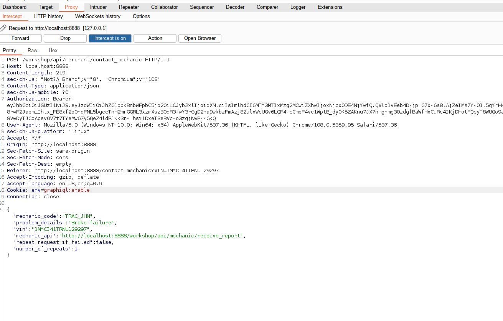
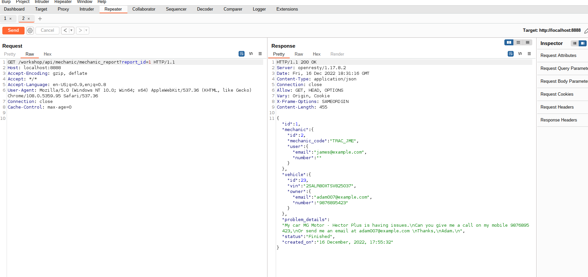

crAPI is a vulnerable API used to illustrate and educate OWASP API Top 10 vulnerabilities. The goal is to find many vulnerabilities as possible and understand root cause by exploiting the bug. The vulnerable API can be downloaded from the following github repository <a href="https://github.com/OWASP/crAPI">crAPI</a>.

BOLA vulnerabilities are vulnerabilities that allows disclosure of sensitive information about other users. First step in finding BOLA vulnerabilities is to look for UUID of other accounts/users. The challenges in this API security shows how various security implications are manifested and how they can be exploited.

## Challenge 1 - Access details of another user's vehicle

> To solve the challenge, you need to leak sensitive information of another user’s vehicle.
>
> - Since vehicle IDs are not sequential numbers, but GUIDs, you need to find a way to expose the vehicle ID of another user.
> - Find an API endpoint that receives a vehicle ID and returns information about it.

To solve first challenge is to identify UUID of another user's vehicle and try to access their resources. The figure belows shows the vehicle ID of the logged in user.

The API endpoint URL showing the vehicle details is **/identity/api/v2/vehicle/986545c7-afa8-4711-bdab-329011db46fe/location**. To access the information of another vehicle details, we need to replace the UUID with the one of the target vehicle. Because of an high entropy of the UUID, they cannot be easily guessed, therefore to get UUID of vehicles, one should for clues either in comments, profile, images e.t.c. This is possible due to excessive data exposure in the community post section.

Looking at the community posts as shown in the image above, we are able to leak vehicleID of other users, i.e `pogba` whose vehicleID is **c562d2d3-2faf-4410-909a-ac8862d7509f**.Replacing logged in user car UUI with **pogba**, we are able to leak location details. For replaying http requests use `repeater` which is part of BurpSuite toolkit.

## Challenge 2 - Access mechanic reports of other users

> crAPI allows vehicle owners to contact their mechanics by submitting a "contact mechanic" form. This challenge is about accessing mechanic reports that were submitted by other users.
>
> - Analyze the report submission process
> - Find an hidden API endpoint that exposes details of a mechanic report
> - Change the report ID to access other reports

For Solving the challenge, First is to intercept the http requests sent to the backend server in order to identify the URL endpoint using Burp proxy. The endpoint for viewing mechanic report is `http://localhost:8888/workshop/api/mechanic/receive_report`.

To access report of another user, we can change the report id with another in the API endpoint `/workshop/api/mechanic/mechanic_report?report_id=1` and replay requests. Changing report_id value, results to us disclosing report by james.

For Bruteforcing the **report_id** value, one can use Intruder to check various payload in the id position and check for successful response status. IF the response status is `200` means the id contains a report.
