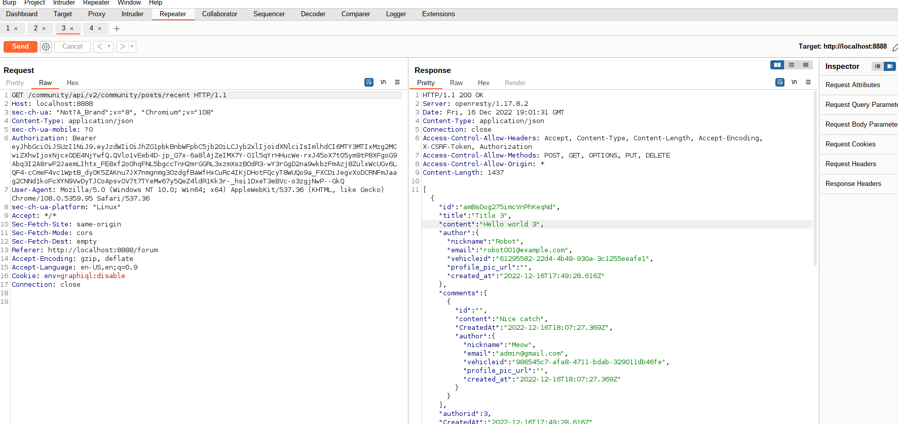

Excessive Data Exposure is a vulnerability that occurs due to additional information which is returned by the API, which expected to be filtered or ignored by client. The extra information returned by the API endpoint may contain sensitive data about users, financial data etc, which may lead to a breach of data or breach data protection laws.

## Challenge 4 - Find an API endpoint that leaks sensitive information to other users

The goal of this challenge is to identify the endpoint that leaks sensitive information about its users.The endpoint is `/community/api/v2/community/posts/recent` which leaks for information about the owner email and vehicle details.

The information from the sensitive information may be used to escalate the privileges of the system, information disclosure through vehicleID `IDOR`, resetting other people password and locking them out.
