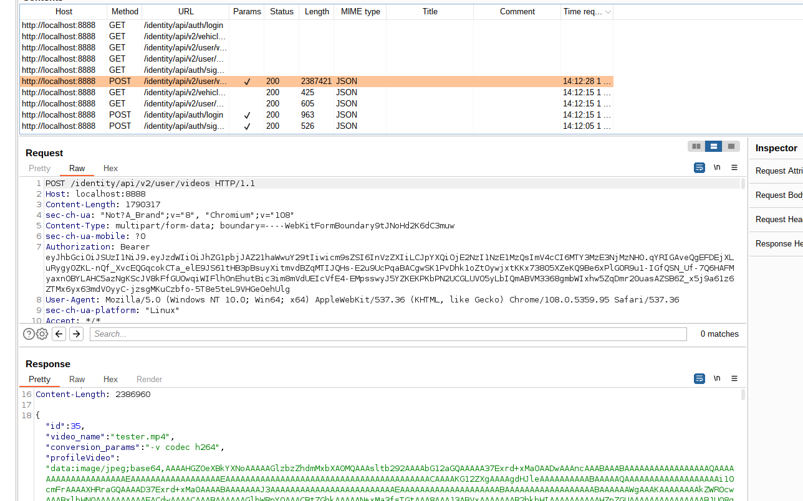

BFLA is a vulnerability that allows one user to do CRUD (Create, Read, Update, Delete) operations as another user of the vulnerable application. This vulnerability may lead to data loss and breach or DOS if the user is locked out of his/her own account.

## challenge 7 - Delete a video of another user

To delete a video of another user, One needs to create another account in the Platform so as to replicate the scenario of the other user. Create a new user in the application and upload a new video under the new user. Example, upload video as `george` and note ID of the video uploaded. This will help in performing an BFLA attack as another user

The uploaded video ID is `35` as shown in figure above. By deleting the video, a normal user can't delete a video unless he/she is an admin, `DELETE` is only possible to users with admin privileges. One can bypass Authorization implementation in the API by forging a new JWT token.

Because the API does not validate JWT Tokens, One can manipulate the user Role privileges stored in the token body payload and therefore delete george video. After forging the tokens, replace the Authorization with the new one and send a request.
