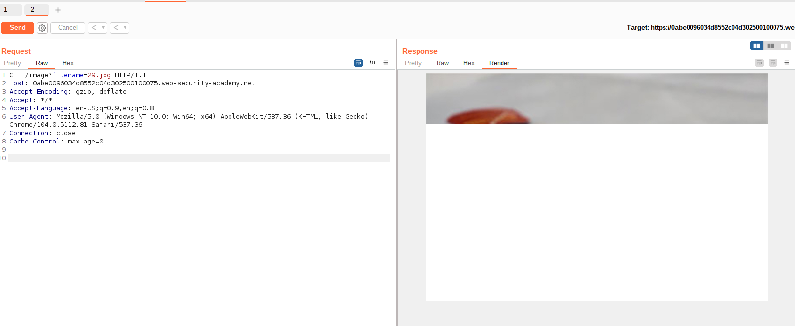
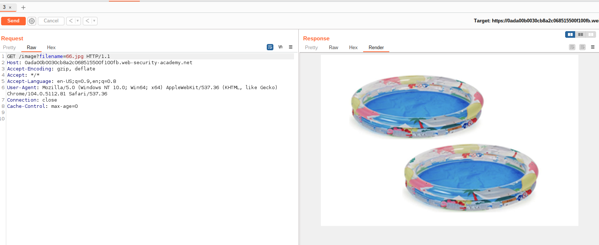
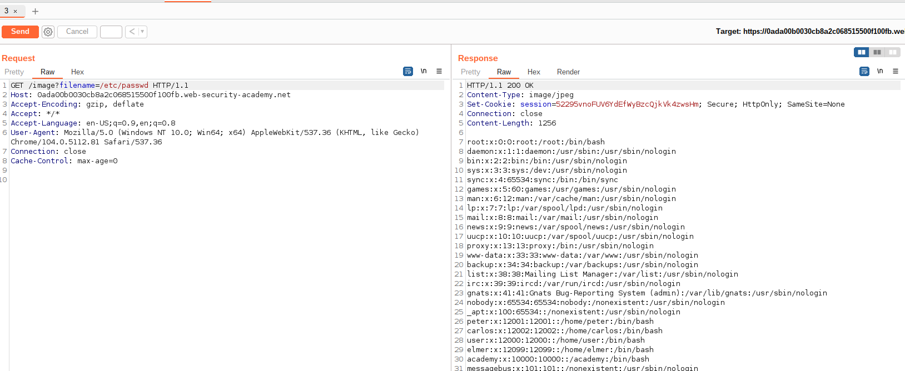
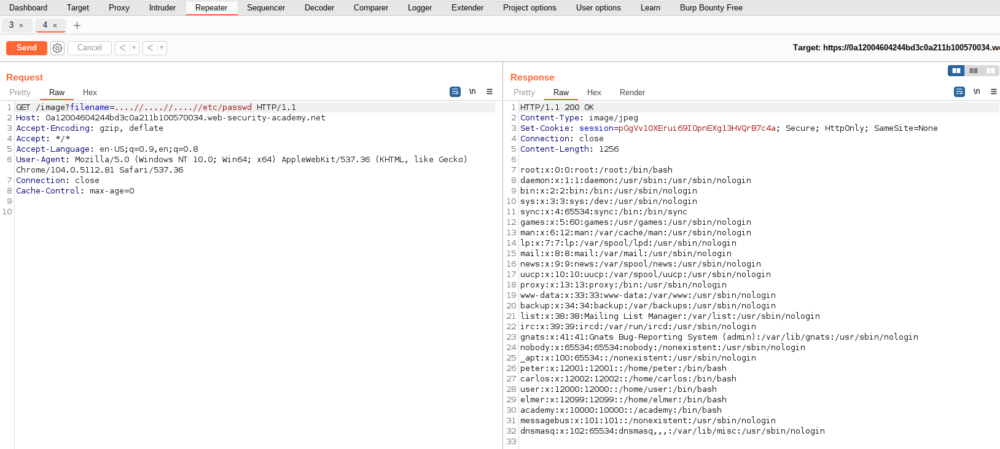

Directory traversal are web vulnerabilities that allows an attacker to access unauthorized resources outside the root server directory due to the way server handles the files.

The files which an attacker can read include Intellectual property, customer data, code and sensitive file system files such as configuration keys.

For understanding the vulnerabilities by solving the `portswigger.net` academy Directory traversal labs.

## Lab1: Simple case File path traversal

The description of the challenge is

> This lab contains a file path traversal in the display of product images.
> To solve the lab retrieve the contents of the /etc/passwd file.

For solving the challenge, right click one of the images and open in a new tab.This will enable us to capture the file path of image.

solved the problem

## Lab2: Absolute path traversal bypass

> This lab contains a file path traversal vulnerability in the display of product images.
> The application blocks traversal sequences but treats the supplied filename as being relative to a default working directory.
> To solve the lab, retrieve the contents of the /etc/passwd file.

Solution for absolute file path

## Lab3: Stripped non-recursive path traversal

> This lab contains a file path traversal vulnerability in the display of product images.
> The application strips path traversal sequences from the user-supplied filename before using it.
> To solve the lab, retrieve the contents of the /etc/passwd file.

## Lab4:

## Lab5: Start of path file validation path traversal

> This lab contains a file path traversal vulnerability in the display of product images.
> The application transmits the full file path via a request parameter, and validates that the supplied path starts with the expected folder.
> To solve the lab, retrieve the contents of the /etc/passwd file.

Solution for the above challenge is

## Lab6: Bypass Validation of path file extension

> This lab contains a file path traversal vulnerability in the display of product images.
> The application validates that the supplied filename ends with the expected file extension.
> To solve the lab, retrieve the contents of the /etc/passwd file.

