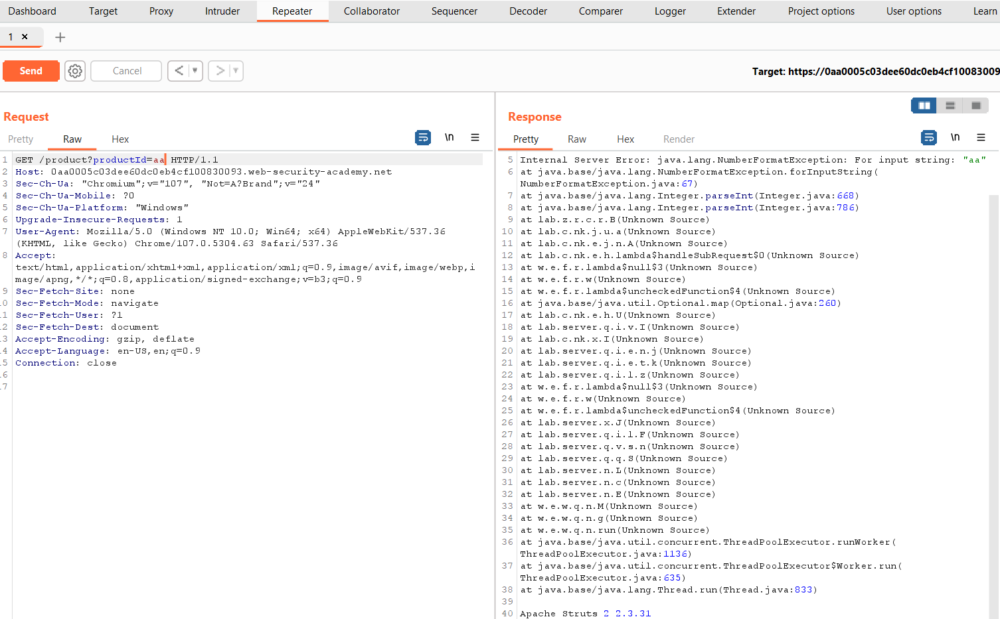
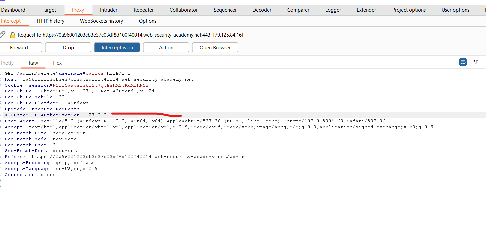
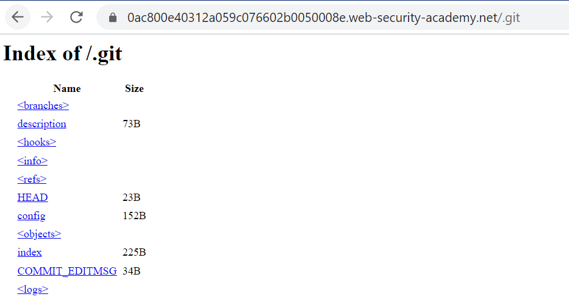
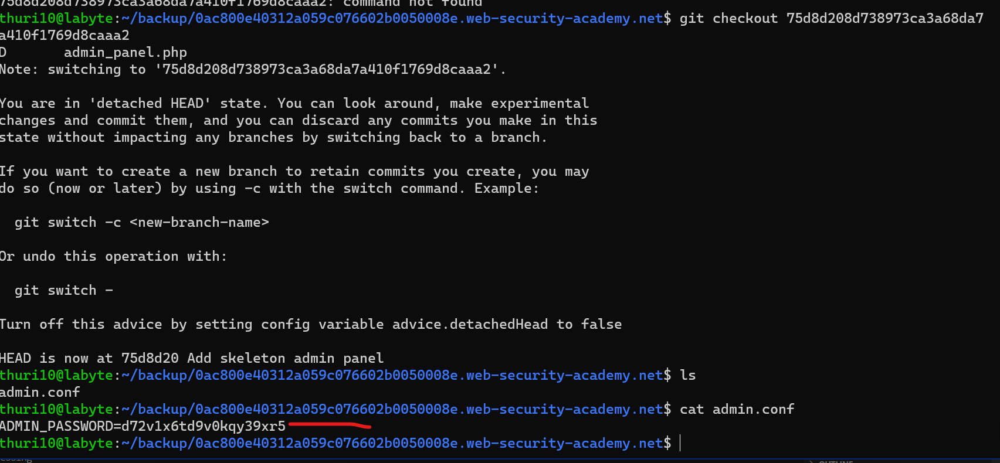

Information disclosure is a web vulnerability that allows leakage of sensitive information to it's users. Information leaked may include other user's sensitive information, passwords and username, Intellectual property, source code, etc depending on the context of the application.

To understand impact of the information disclosure vulnerabilities, we solve **portswigger** information disclosure labs.

## Lab1 - Information disclosure in error messages

> This lab's verbose error messages reveal that it is using a vulnerable version of a third-party framework. To solve the lab, obtain and submit the version number of this framework.

To solve the challenge, we need to trigger an error message according to lab description. To trigger an error for example we can change the data type of productID from `int` to `string` and observer the response from the server. Image below response when we trigger an error with **aa** as our product ID.


From the http response we are able to leak information about the server by triggering an exception on the server.The version of the software is **Apache Struts 2 2.3.31** as shown in the response.

## Lab2 - Information disclosure on debug page

> This lab contains a debug page that discloses sensitive information about the application. To solve the lab, obtain and submit the SECRET_KEY environment variable.

To solve the challenge, first we start with reconnaissance in order to understand how the application is structured. First thing is to check for robots.txt file and view source code of the index page.


By viewing source code , we have debug page URL path commented out. **/cgi-bin/phpinfo.php**. By navigating to the referenced URI we get a PHP debug page as shown below.


Looking at the enviroment variables, we are able to get **SECRET_KEY** parameter value.The secret key is `qxptwgij0q108ugpi5btaxyjb9pq7...`

## Lab3 - Source code disclosure via backup files

> This lab leaks its source code via backup files in a hidden directory. To solve the lab, identify and submit the database password, which is hard-coded in the leaked source code.

First step is to do a reconnaissance on the web application on whether the robots.txt file is available or not. By navigating to the robots.txt file path, we now get the backup URL.


By visiting **/backup** path we get Java source code which has been backed up.


The source code Backup is below.

```java
package data.productcatalog;

import common.db.JdbcConnectionBuilder;

import java.io.IOException;
import java.io.ObjectInputStream;
import java.io.Serializable;
import java.sql.Connection;
import java.sql.ResultSet;
import java.sql.SQLException;
import java.sql.Statement;

public class ProductTemplate implements Serializable
{
    static final long serialVersionUID = 1L;

    private final String id;
    private transient Product product;

    public ProductTemplate(String id)
    {
        this.id = id;
    }

    private void readObject(ObjectInputStream inputStream) throws IOException, ClassNotFoundException
    {
        inputStream.defaultReadObject();

        ConnectionBuilder connectionBuilder = ConnectionBuilder.from(
                "org.postgresql.Driver",
                "postgresql",
                "localhost",
                5432,
                "postgres",
                "postgres",
                "jp2sytqk09qeraocb9a8ud5536r7loho"
        ).withAutoCommit();
        try
        {
            Connection connect = connectionBuilder.connect(30);
            String sql = String.format("SELECT * FROM products WHERE id = '%s' LIMIT 1", id);
            Statement statement = connect.createStatement();
            ResultSet resultSet = statement.executeQuery(sql);
            if (!resultSet.next())
            {
                return;
            }
            product = Product.from(resultSet);
        }
        catch (SQLException e)
        {
            throw new IOException(e);
        }
    }

    public String getId()
    {
        return id;
    }

    public Product getProduct()
    {
        return product;
    }
}
```

By auditing the above source code we now have the database password which is **jp2sytqk09qeraocb9a8ud5536r7loho**.

Lesson: Never HARDCODE passwords or username in the source code, use environment variables to reduce damage or impact incase of a compromise.

## Lab4 - Authentication bypass via information disclosure

> This lab's administration interface has an authentication bypass vulnerability, but it is impractical to exploit without knowledge of a custom HTTP header used by the front-end.
> To solve the lab, obtain the header name then use it to bypass the lab's authentication. Access the admin interface and delete Carlos's account.
> You can log in to your own account using the following credentials: wiener:peter

To solve the lab, we visit the admin interface as shown in image below.


From the description above, the admin interface is only available for local users. To bypass this restriction, we need to modify our HTTP request to appear as if sent from the local user. To determine the custom X-Forward Method, we use **TRACE** to send our request instead of **GET**.


From the response, the server implements `X-Custom-IP-Authorization` header in order to access the admin page.Using `X-Custom-IP-Authorization: 127.0.0.1` in our HTTP header, we can proxy our request in burpSuite and delete `carlos` from the server.



## Lab5 - Authentication disclosure in version control history

> This lab discloses sensitive information via its version control history. To solve the lab, obtain the password for the administrator user then log in and delete Carlos's account.

By appending `.git` to the URL we get a git folder structure.


To download all files, one can use **wget -r URLPATH** into a local folder.First, Use `git diff` to check files contents have been modified or changed as shown in image below.


To get original values before being modified, we check out the previous commit. Now we are able to get the configured admin password from the configuration file as shown in image below.



The admin password is **d72v1x6td9v0kqy39xr5**
